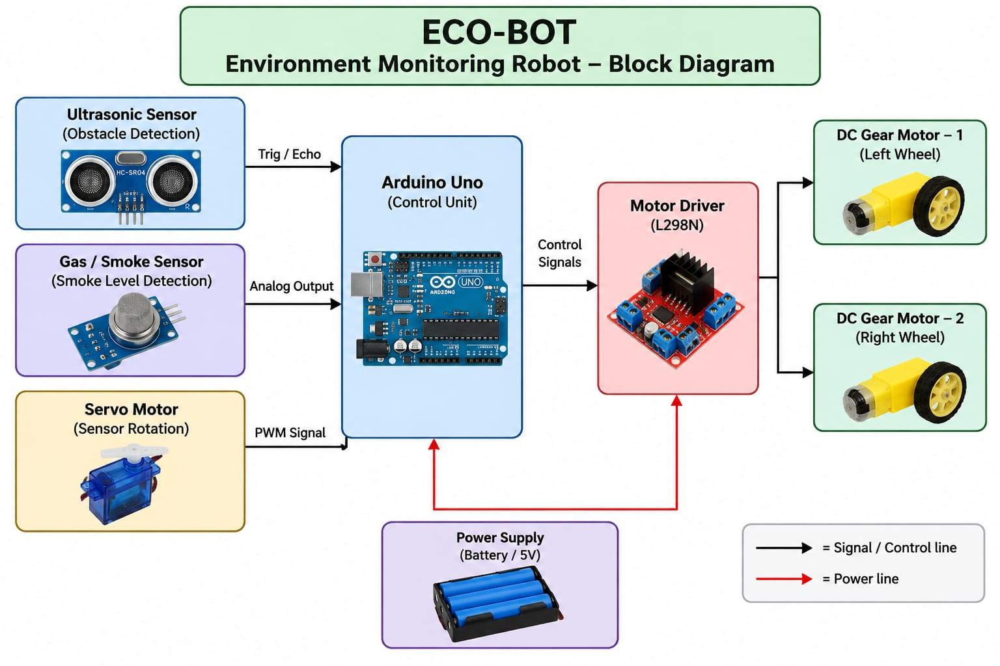

ECO-BOT
(Environment Montoring Robot)

Project Description:  
  ECO-BOT is an Arduino-based robot designed to monitor environmental hazards and detect unsafe conditions. It uses an ultrasonic sensor to detect obstacles and a gas/smoke sensor to monitor smoke or gas levels. A servo motor helps scan the surroundings, while two DC gear motors provide car-like movement through a motor driver.

Problem Statement:  
  To develop a mobile robot that can detect obstacles and monitor smoke or gas levels in an environment, helping identify potentially hazardous conditions.

Components Used:  
  Arduino   
  Ultrasonic Sensor   
  Gas/Smoke Sensor   
  Servo Motor  
  2 DC Gear Motors  
  Motor Driver   
  Robot chassis and wheels   
  Battery/power supply   
  Jumper wires  

Procedure:   
  1)Fix the two DC gear motors and wheels to the robot chassis.  
  2)Connect the two motors to the motor driver for controlling the robot's movement.  
  3)Connect the motor driver to the Arduino through the required control pins. 
  4)Mount the ultrasonic sensor on the servo motor so that it can scan different directions.  
  5)Connect the gas/smoke sensor to an analog input of the Arduino.  
  6)Connect the servo motor to a suitable Arduino digital/PWM pin.  
  7)Provide a suitable power supply for the Arduino, motor driver, and motors.  
  8)Upload the Arduino program to control obstacle detection, smoke/gas monitoring, and motor movement.  
  9)When an obstacle is detected, the robot stops and changes direction.  
  10)The gas/smoke sensor continuously monitors the surrounding environment for increased smoke/gas levels.  

Working:  
  The ultrasonic sensor detects obstacles in the robot's path.
The servo motor rotates the sensor to scan different directions.
When an obstacle is detected, the Arduino controls the motors to change direction.
The gas/smoke sensor detects increased smoke or gas levels.
The Arduino processes the sensor readings and controls the robot accordingly.
Two DC gear motors provide forward, backward, and turning movements similar to a small car.

Advantages:  
  1)Obstacle detection: Helps the robot avoid objects in its path.  
  2)Environmental monitoring: Detects smoke/gas levels in the surroundings.  
  3)Automatic movement: Arduino controls the robot based on sensor inputs.  
  4)360° scanning: Servo-mounted ultrasonic sensor can scan different directions.  
  5)Low-cost: Uses commonly available electronic components.  
  6)Compact and mobile: Can move around like a small car.  
  7)Expandable: Additional sensors such as temperature, flame, or humidity sensors can be added later.  

Result:  
  The ECO-BOT was successfully developed as an Arduino-based environment monitoring robot. It can detect obstacles using an ultrasonic sensor and monitor smoke/gas levels using a gas/smoke sensor. The servo motor enables directional scanning, while the two DC gear motors provide car-like movement through the motor driver.

